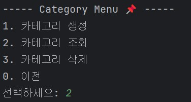

## 📘 To-Do List 프로젝트

### 1. 주요 기능
- 회원 가입 및 로그인
- 카테고리 생성 (사용자가 직접 카테고리명 지정)
- 카테고리별 리스트 추가 및 관리
- 리스트 항목 체크/해제 기능

### 2. 기능별 시퀀스 다이어그램
#### 1) 사용자 회원가입 및 로그인
📌 로그인
  
📌 회원가입

#### 2) 카테고리 관리 (생성, 조회, 삭제)
📌 카테고리 생성
  
📌 카테고리 조회
  
📌 카테고리 삭제

#### 3) 리스트 관리 (생성, 조회, 삭제, 체크/해제)
📌 리스트 생성
  
📌 리스트 조회
  
📌 리스트 삭제
  
📌 리스트 체크/해제

- 리스트 체크/해제 쿼리

### 3. 리스트 체크해보기
✅ **로그인 → 카테고리 조회 → 리스트 조회 → 리스트 체크****
📌 로그인
- 아이디와 비밀번호로 로그인

📌 카테고리 메뉴 - 조회
- 로그인에 성공하면 카테고리 메뉴를 볼 수 있음

📌 조회할 카테고리 선택
- 조회할 카테고리 명 입력

📌 리스트 메뉴 - 리스트 조회
- 해당 카테고리명의 리스트 메뉴

📌 리스트 목록

📌 리스트 체크

